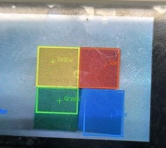
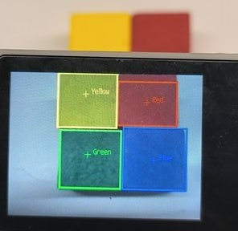
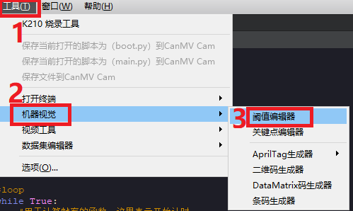
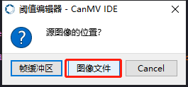
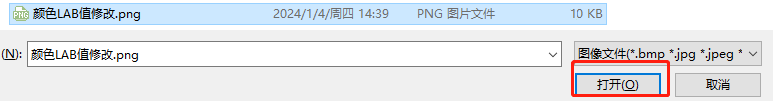
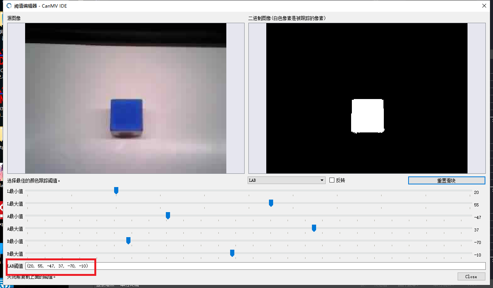

# 14、多种颜色识别

[toc]


## 1.1 实验目标
本节课主要进行多种颜色识别功能，根据颜色的LAB值，框出不同颜色（红、黄、蓝、绿）的物体，无需进行采集的过程
本次实验的参考代码路径为：K210_Broad\05-AI\multi_color_recognition.py

## 1.2 实验过程

使用改例程，将K210开发板烧录python出厂固件，请参考前面的烧录固件教程，再进行实验。

1. 导入相关库，并初始化摄像头和LCD显示屏
```python
import sensor
import time
import lcd

lcd.init()
sensor.reset()
sensor.set_pixformat(sensor.RGB565)
sensor.set_framesize(sensor.QVGA)
sensor.skip_frames(time = 100)
sensor.set_auto_gain(False)
sensor.set_auto_whitebal(False)

clock = time.clock()
```

2. 进行颜色lab值的阈值范围编写
```python
color_thresholds = [
    (31, 69, 27, 58, 14, 36),# Red
    (14, 61, -39, -6, 0, 14), # Green
    (14, 66, 1, 38, -56, -12),# Blue
    (49, 77, -8, 52, 16, 60),# Yellow
]
color_strings = ['Red', 'Green', 'Blue', 'Yellow']
```

3. 新建一个while循环，对摄像头采集的画面进行颜色识别，并把识别的结果显示在屏幕上
```python
while True:
    clock.tick()
    img = sensor.snapshot()
    for color_idx, threshold in enumerate(color_thresholds):
        blobs = img.find_blobs([threshold], pixels_threshold=100, area_threshold=100, merge=True, margin=10)
        if blobs:
            for blob in blobs:
                color_new = (255 , 255,255)
                if color_idx == 0 :
                    color_new = (255 , 0,0)
                elif color_idx == 1:
                    color_new = ( 0,255 ,0)
                elif color_idx == 2:
                    color_new = ( 0,0,255)
                elif color_idx == 3:
                    color_new = ( 255,255,0)
                img.draw_rectangle(blob.rect(), color=color_new,thickness = 3)
                img.draw_cross(blob.cx(), blob.cy(), color=color_new)
                img.draw_string(blob.cx() + 10, blob.cy() - 10, color_strings[color_idx], color=color_new)
    lcd.display(img)
    print(clock.fps())
```

## 1.3、实验效果
将K210开发板通过type-c数据线连接到电脑上，CanMV IDE点击连接按钮，连接完成后点击运行按钮，运行例程代码。也可以将代码作为main.py下载到K210开发板上运行。

等待系统初始化完成后，LCD显示摄像头画面，并开始对画面进行识别，把识别到的颜色显示到屏幕上。
- 下图是OV2640摄像头识别出的结果

- 下图是GC2145摄像头识别的结果



## 1.4、实验总结
多种颜色识别的功能主要是分析颜色的LAB值，再与摄像头采集到的颜色的LAB值作为分析对比，如果符合要求则画出方框并标注对应的颜色，表示识别。该办法对识别出的颜色的环境光有比较大的影响，不同的环境光LAB的值会有所不同，下面将讲解如何根据环境光，修改LAB的值，或者是添加除教程外的DIY颜色。


# 2.1、增加新的颜色进行识别
只需要在程序源码这里增加想要识别的颜色和阈值即可，以下的伪代码需自己修改
```python
color_thresholds = [
    (31, 69, 27, 58, 14, 36),# Red
    # Green
    (14, 61, -39, -6, 0, 14),
    (14, 66, 1, 38, -56, -12),# Blue
    (49, 77, -8, 52, 16, 60),# Yellow
    (需要增加的LAB的值)#DIY的LAB值 ，需自行修改
]
color_strings = ['Red', 'Green', 'Blue', 'Yellow','需要增加的自定义颜色'] #需自行修改
```

# 2.2、获取需要增加颜色的 LAB 阈值
若需要获取新增颜色的 LAB 阈值，或者是根据环境光要修改的颜色LAB值。都可以通过 CanMV IDE 的工具获取。

1. 双击 CanMV IDE 打开，点击“工具->机器视觉-> 阈值编辑器”选择阈值编辑器工具。


2. 点击“图像文件”  
**也可以点帧缓冲区（此办法获取LAB值本教程不阐述，注意一点：需要k210连接上cammv，cammv不能禁用帧缓冲区）**


3. 选择准备好含有需要新增颜色的图片，或者根据当前环境光要识别颜色的图片（尽量选择背景干净，没有其他颜色干扰的图片）


4. 拖动滑块直至识别颜色区域全为白色，其他区域全为黑色，记录得到的 LAB 阈值



5. 把得到的阈值放进源码当中即可，根据**2.1**的说明做修改即可

   
